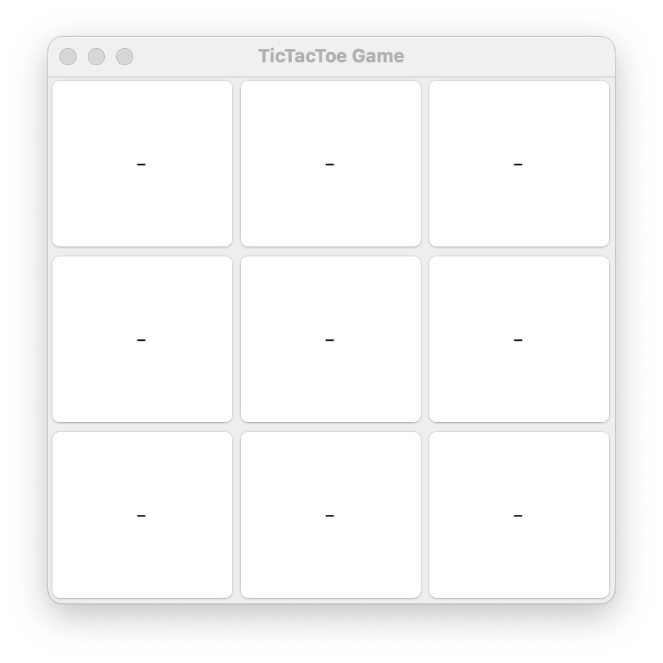
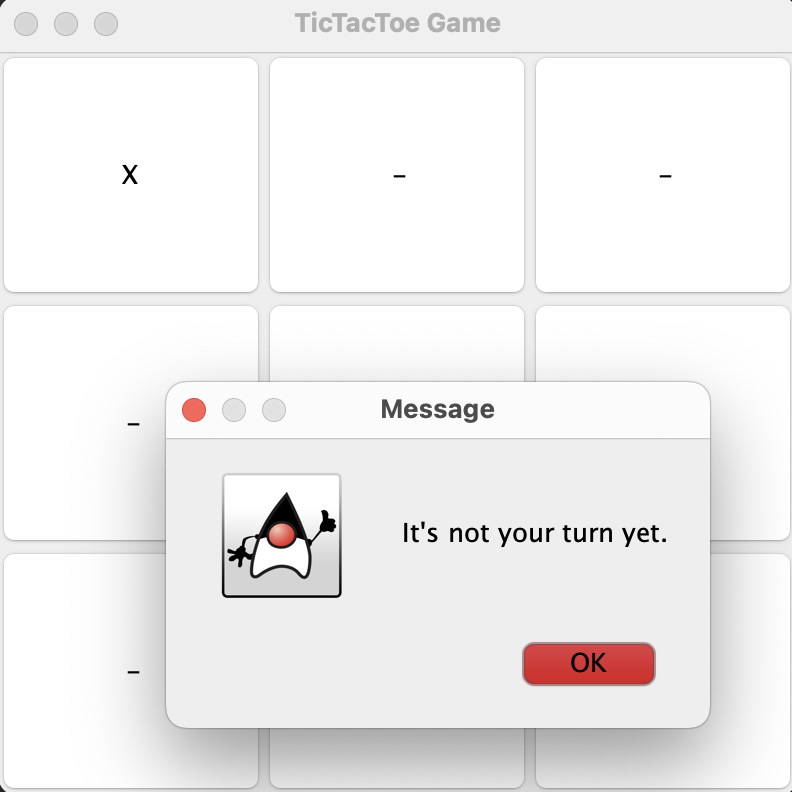
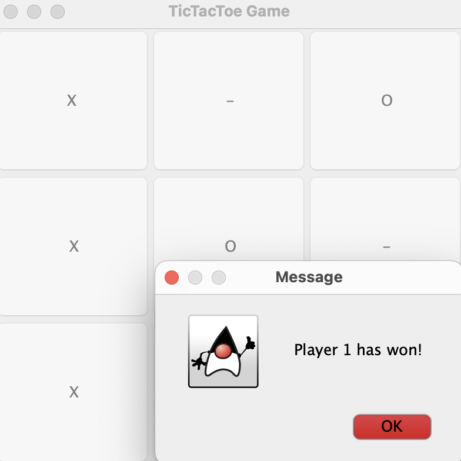
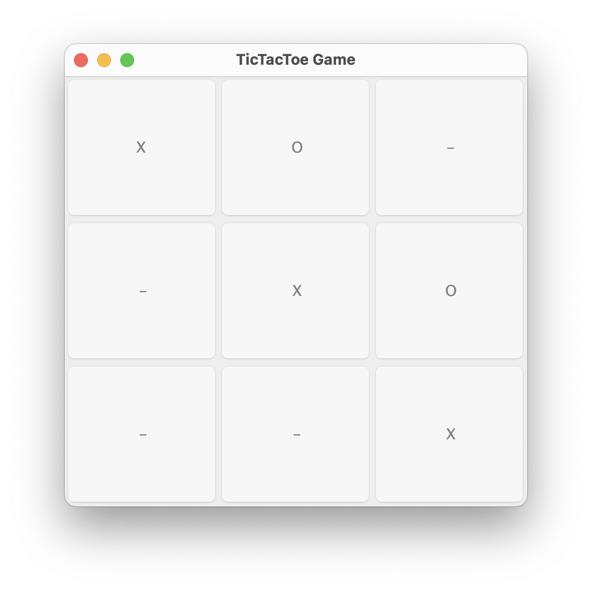

# Tic-Tac-Toe Game

## Description

Tic-Tac-Toe is a classic game played on a 3x3 square board. Two players take turns placing their marks (X or O) on empty spaces. The first player to get three of their marks in a row (horizontally, vertically, or diagonally) wins the game.

## Screenshots

## Technologies

- Java
- Java Swing for the graphical user interface
- Socket programming for communication between client and server

## Features

- Local network play
- Detection of wins and draws
- Display of the current game state
- Support for multiple game sessions

## How to Run

1. **Start the Server**:

   - Open `Server.java` and run it.
   - The server will start on a default port (3000).
   - The server is designed to handle multiple game sessions, each supporting two players. This means that multiple sessions can run simultaneously, allowing more than two players to participate in games.

2. **Connect the Players**:
   - Open `TicTacToeGUI.java` on two different computers (or in multiple instances) and connect to the server's IP address.
   - Each pair of players will join a new game session managed by the server.

## How the Server Works

The server operates by managing sessions. Each session allows two players to compete against each other. When players connect to the server, they are assigned to a session where they can play Tic-Tac-Toe. The server can handle multiple sessions concurrently, which enables multiple pairs of players to play the game at the same time.

## How to Play

1. Two players take turns making their moves.
2. A player can make a move by selecting an empty space on the board.
3. The game continues until one player wins or a draw is reached.

## Rules

- **Win**: The player who first achieves three of their marks in a row (horizontally, vertically, or diagonally).
- **Draw**: If all spaces are filled and no player has won, the game is considered a draw.
